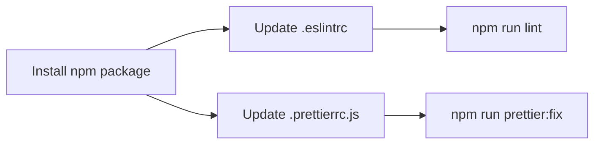

# @dunder-mifflin/eslint-config-prettier

A shareable ESLint, Prettier, and various others config.

## Installation

```bash
npm install --save-dev @dunder-mifflin/eslint-config-prettier
```

- `package.json` scripts should be updated to include the following:

```json
{
  "scripts": {
    ...
    "lint": "eslint .",
    "lint:fix": "eslint . --fix",
    "prettier:fix": "prettier --write ."
  }
}
```

- `.prettierignore` and `.eslintignore` should also be replaced

## Usage

Add the following to your `.eslintrc`:

```json
{
  "extends": ["@dunder-mifflin/eslint-config-prettier/.eslintrc"]
}
```

Add the following to your `.prettierrc.js`:

```js
module.exports = {
  ...require('@dunder-mifflin/eslint-config-prettier').prettier,
};
```

## Step by step



## Notes

Nice to have
- tsconfig extends
- husky & pre-* scripts
- package.json extends ?